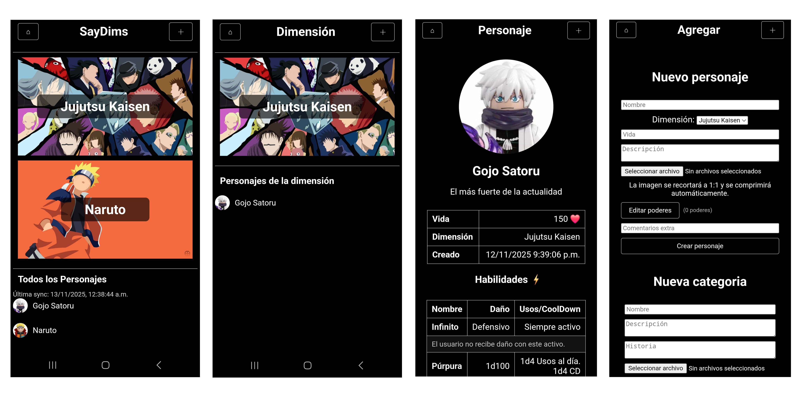

# SayDim

Aplicación web ligera para ESP32 que gestiona Dimensiones y Personajes desde una tarjeta microSD. La interfaz es multipágina (inicio, dimensión, personaje y agregar), los datos e imágenes viven en la SD y el ESP32 expone un API HTTP simple para consultar y crear contenido.

## Planteamiento

Hasta el momento, había trabajado únicamente en repositorios privados para proyectos universitarios. Me propuse iniciar un proyecto personal que pudiera publicar y decidí desarrollarlo pensando en mi hermano menor. Se trata de una plataforma en la que él pueda acceder a la información de los personajes que posee como minifiguras, así como a las características que les atribuye al jugar. Anteriormente, él utilizaba un chat de WhatsApp para registrar estos datos, pero con esta plataforma podrá acceder a ellos de manera más cómoda y estructurada. A continuacion un ejemplo cos dos personajes de dos dimensiones distintas:



## Características

- UI multipágina servida desde la SD: `index.html`, `dimension.html`, `character.html`, `add.html`.
- Gestión de Dimensiones y Personajes con imágenes JPEG almacenadas en `/dimensions` y `/characters`.
- Creador visual de poderes (popup) en “Agregar personaje” con filas dinámicas.
- Subida de imágenes optimizada en el cliente (recorte/escala y compresión JPEG) antes de enviar.
- API REST sencilla en el ESP32 para listar y crear recursos.

## Requisitos

- ESP32 compatible con core Arduino y módulo/slot para microSD.
- Tarjeta microSD.
- Arduino IDE o PlatformIO para compilar y flashear.

## Estructura en la SD

Estructura mínima recomendada en la raíz de la SD:

```
/www/
  index.html
  dimension.html
  character.html
  add.html
  css/
    styles.css
  js/
    app.js
    mock.js
/data/
  dimensions.json
  characters.json
  order.json
/dimensions/   (imágenes de dimensiones)
/characters/   (imágenes de personajes)
```

Notas importantes:

- La UI se sirve desde `/www`. Copia esa carpeta tal cual a la SD.
- Los objetos JSON referencian imágenes como rutas tipo `/dimensions/<id>.jpg` o `/characters/<id>.jpg`.
- El cliente descarga imágenes mediante `GET /asset/<ruta>` (p. ej. `/asset/dimensions/abc.jpg`).

Más detalles: `docs/SD_LAYOUT.md`.

## Puesta en marcha

1. Flashear el firmware

- Abre `SayDim/SayDim.ino` en el IDE, ajusta red/pines si hace falta y flashea el ESP32.
- El firmware registra rutas estáticas para las páginas y expone `GET /api/*` y `POST /upload/*`.

2. Preparar la SD

- Formatea en FAT32 y copia la carpeta `www` a la raíz de la SD.
- Asegura que existen `/data/dimensions.json`, `/data/characters.json` y `/data/order.json` (vacíos `[]` si empiezas de cero).

3. Encender y acceder

- Inserta la SD, alimenta el ESP32 y abre en el navegador `http://<ip>/` (ej. `http://192.168.1.200`).
- Si faltan archivos estáticos, revisa `http://<ip>/ls` y corrige la estructura en la SD.

## Uso básico

- Inicio (`index.html`)

  - Muestra banners de Dimensiones y una lista de personajes.
  - Botón ⌂: inicia una sincronización que guarda datos e imágenes en el caché local (IndexedDB).
  - “Última sync”: indicador con la fecha/hora de la última sincronización exitosa.

- Dimensión (`dimension.html?id=<id>`)

  - Muestra el banner de la dimensión y sus personajes.

- Personaje (`character.html?id=<id>`)

  - Muestra detalles, habilidades y “Otras versiones” (mismo personaje en otras dimensiones vía `multiverseId`).

- Agregar (`add.html`)
  - Formularios para crear Dimensión y Personaje.
  - Creador de poderes con popup: añade/elimina filas y se guarda como JSON automáticamente.
  - Imágenes: 16:9 para dimensiones y 1:1 para personajes; la compresión se hace en el navegador.
  - Los campos “Daño” y “Usos/CoolDown” del popup se tratan como texto para admitir formatos flexibles.

## Sincronización y modo offline

El proyecto no usa Service Worker (el ESP32 sirve por HTTP). En su lugar:

- La sincronización manual (botón ⌂ en `index.html`) descarga:
  - Datos desde `GET /api/dimensions` y `GET /api/characters`.
  - Imágenes desde `GET /asset/<ruta>` y las guarda como blobs en IndexedDB.
- Cuando el dispositivo no está disponible:
  - Las llamadas a API caen automáticamente a IndexedDB (se muestran dimensiones/personajes cacheados; también se respeta el filtro `?dim=`).
  - Las imágenes se cargan desde el blob cacheado si existe; si no está cacheada y no hay red, la imagen no se muestra.
- Limitación natural sin SW: si el ESP32 está apagado, no se pueden abrir páginas nuevas (no hay quién sirva el HTML). Abre al menos `index.html` cuando tienes conexión y sincroniza para trabajar luego sin conexión.

## API (resumen)

Principales endpoints (sin auth, JSON):

- `GET /api/status` → `{ sdAvailable: true|false }`
- `GET /api/dimensions` → lista de dimensiones
- `GET /api/characters?dim=<id>` → lista de personajes (opcional filtrar por dimensión)
- `POST /upload/dimension` (multipart) → crea dimensión + portada
- `POST /upload/character` (multipart) → crea personaje + foto
- `GET /asset/<path>` → sirve imágenes desde la SD

Campos destacados de personaje:

- `id`, `nombre`, `dimension` (id), `dimensionName` (opcional), `vida`, `foto` (`/characters/<id>.jpg`), `descripcion`, `powers` (array), `comentarios`, `created` (epoch seg), `multiverseId` (opcional).

Detalles completos y ejemplos: `docs/API.md`.

## Desarrollo local

- Para iterar la UI sin el ESP32, sirve la carpeta `www` (por ejemplo con Python `http.server`) y añade `?mock=1` a la URL:
  - `http://localhost:8000/index.html?mock=1`
  - El modo mock intercepta `/api/*` y simula respuestas en memoria.
- Para desactivar el mock, quita el query `?mock=1`.

Más información: `docs/USAGE.md`.

## Solución de problemas

- 404 en `/asset/...` → el archivo no está en la SD o la ruta está mal formada; verifica con `http://<ip>/ls`.
- Datos aparecen offline pero imágenes no → faltó cachear imágenes; sincroniza con el botón ⌂ y verifica rutas.
- Páginas distintas a `index.html` dan 404 → usa firmware actualizado con rutas explícitas.

Guía detallada: `docs/TROUBLESHOOTING.md`.

## Estructura del repositorio

- `SayDim/SayDim.ino` — firmware del ESP32 (servidor, SD, API, uploads, NTP).
- `www/` — interfaz web (HTML/CSS/JS).
- `docs/` — documentación: arquitectura, API, layout SD, uso y troubleshooting.

## Licencia

Añade aquí la licencia (MIT/Apache-2.0/etc.). Este repositorio no incluye una licencia explícita por ahora.

## Estado del proyecto

Branch principal de trabajo: `develop`.
