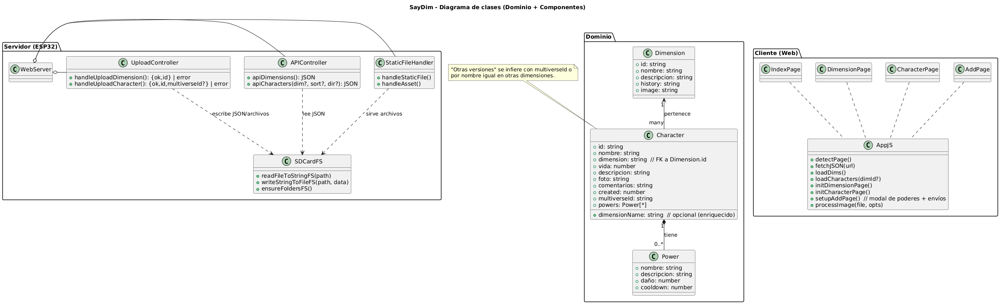
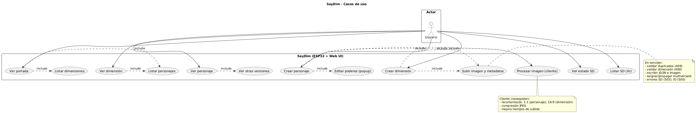

# Arquitectura de SayDim

## Resumen

SayDim está diseñado como una aplicación cliente/servidor ligera donde:

- El servidor es el ESP32 con soporte para tarjeta microSD.
- El cliente es una app multipágina (HTML/CSS/JS) servida desde la SD y consumida por el navegador.

## Diagramas

Diagrama de clases

Diagrama de casos de uso

## Componentes

1. Firmware (ESP32)

   - Librerías principales: WiFi, WebServer, SD, SPI, ArduinoJson.
   - Funciones clave:
     - `handleStaticFile()` — resuelve peticiones a ficheros y las sirve (soporta `.gz`).
     - `handleAsset()` — rutas `/asset/` que mapean a recursos en SD (imágenes subidas).
     - `apiDimensions()` / `apiCharacters()` — devuelven JSON con los datos actuales.
     - `handleUploadDimension()` / `handleUploadCharacter()` — procesan uploads (multipart) y escriben en SD.
   - Estructura de datos: dimensiones y personajes se almacenan en `/data/dimensions.json` y `/data/characters.json`.

2. Interfaz web

   - Páginas: `index.html`, `dimension.html`, `character.html`, `add.html`.
   - Estilos y scripts: `www/css/styles.css`, `www/js/app.js`, `www/js/mock.js`.
   - Flujo: el JS consume `GET /api/dimensions` y `GET /api/characters` y usa `/upload/*` para enviar formularios con archivos. En `add.html`, un popup construye el JSON de poderes.

3. Tarjeta SD
   - Debe contener al menos:
     - `/www/index.html`, `/www/dimension.html`, `/www/character.html`, `/www/add.html`
     - `/www/css/styles.css`, `/www/js/app.js`, `/www/js/mock.js`
     - `/data/*.json` (inicializados si vacíos)
     - `/dimensions/` y `/characters/` (imágenes subidas)

## Comunicación

- HTTP simple: el navegador hace peticiones GET/POST a la IP del ESP32 (ej. `http://192.168.1.200`).
- No hay autenticación por defecto.

## Decisiones de diseño

- Servir archivos desde SD reduce la memoria ocupada en la flash del ESP y facilita actualizar la UI sin recompilar.
- Se soporta `/asset/` para diferenciar recursos que vienen del almacenamiento (imágenes subidas) de los fijos en `/www`.
- En el cliente, las imágenes se recomprimen (JPEG) y se recortan a la relación de aspecto esperada antes de subir para reducir tamaño.
- El código prioriza simplicidad y trazabilidad (varias salidas Serial para debugging).

## Limitaciones

- No hay autenticación ni HTTPS (por simplicidad y limitaciones del ESP32/SD).
- Performance en SD puede variar según la tarjeta y frecuencia SPI.
- Manejo de concurrencia simple: WebServer síncrono; cargas grandes pueden bloquear si la SD es lenta.
